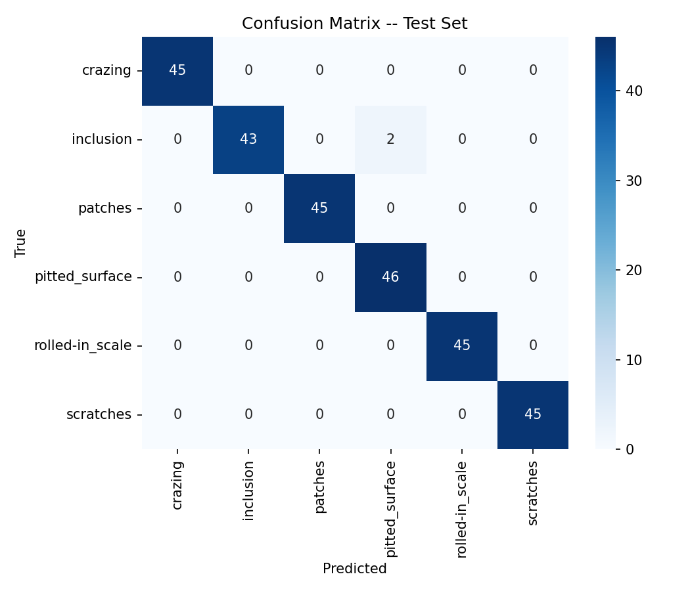

# Steel Defect Detection

Classifies steel surface defects from an image and generates an LLM-backed inspection report — 99.3% test accuracy on the NEU-CLS benchmark, served via a FastAPI endpoint and an interactive Streamlit demo.

**[Live demo](#live-demo)** · try it with no setup, or run locally:

```bash
git clone <this-repo> && cd steel-defect-detection
docker build -t steel-defect-api .
docker run -p 8000:8000 steel-defect-api
# then: curl -X POST http://localhost:8000/predict -F "file=@tests/fixtures/scratches_sample.jpg"
```

## What it does

Steel mills scrap or downgrade coils with surface defects, but a human inspector still has to look at every flagged image and decide what caused it and what to do next. This project automates the first two steps: a computer-vision classifier identifies which of six defect types is present (crazing, inclusion, patches, pitted surface, rolled-in scale, scratches), and an LLM turns that classification into a short structured inspection report — likely cause, recommended action — grounded in real metallurgical facts about each defect type, not free-form guessing.

## Live demo

**[Try it here](#)** — upload your own image or pick a sample, see the classification and LLM-generated report immediately. No install required.

To run the same demo locally instead:

```bash
streamlit run app.py
```

`app.py` runs the classifier and LLM report in-process (same code the API uses — `src/model.py`, `src/llm_report.py`), so it needs no separate server running.

## Results

| Metric | Value |
|---|---|
| Test accuracy | 99.3% (269/271 correct) |
| Macro F1 | 0.993 |
| Weighted F1 | 0.993 |
| Backbone | MobileNetV2 (frozen, ImageNet-pretrained) |
| Model size | 10.0 MB |

Only 2 of 271 held-out test images were misclassified, both `inclusion` samples predicted as `pitted_surface` (see confusion matrix below) — the two defect types that look most visually similar (small dark surface irregularities) even to a trained eye. This accuracy is expected to be optimistic: NEU-CLS is a small, fairly clean academic dataset, not real factory imagery — see [Limitations](#limitations).



Full per-class precision/recall/F1: [reports/classification_report.txt](reports/classification_report.txt).

## Engineering decisions

- **Stratified random split, not time-based.** Unlike the Olist delivery-risk project (which had to split by order date to avoid leaking future information), NEU-CLS has no time dimension, so a 70/15/15 stratified split by class is the correct and simpler choice.
- **Frozen-backbone feature extraction, not fine-tuning.** 1,800 images is too small to fine-tune a CNN's convolutional layers without overfitting. The pretrained MobileNetV2 backbone is frozen; only a small head (Linear → ReLU → Linear) trains on its cached embeddings. This also makes training take seconds on a CPU instead of requiring a GPU.
- **MobileNetV2 over ResNet18.** Both were allowed; MobileNetV2's backbone is ~13MB vs ResNet18's ~45MB, which keeps the final trained artifact (10MB) comfortably committable — the API and Docker image work immediately after cloning, with no retraining step, matching the Olist repo's pattern.
- **The LLM report's grounding.** The classifier's output (defect type, confidence) is deterministic and never touched by the LLM. Only `likely_cause` and `recommended_action` are LLM-generated, and the prompt supplies a fact sheet of real causes/actions per defect type so the model paraphrases known metallurgy instead of inventing it. Ollama (`qwen2.5:7b-instruct`, local, no API key) is used per this portfolio's convention for agent-style projects — see [src/llm_report.py](src/llm_report.py).
- **Template fallback when Ollama is unreachable.** If the LLM call fails or times out (no Ollama running — the case in CI), `generate_report()` falls back to the same fact sheet directly, so `/predict` always returns a valid, non-empty report. The trade-off: fallback reports are templated rather than LLM-composed prose. This is a deliberate, documented limitation, not a silent failure.
- **No decision threshold.** Unlike Olist's binary late/on-time risk score, this is a 6-way classification with no single accept/reject cutoff — the full class-probability vector is returned so a downstream system can set its own confidence bar.

## API

| Endpoint | Method | Description |
|---|---|---|
| `/predict` | POST | Upload an image, get classification + inspection report |
| `/health` | GET | Liveness probe + loaded model's test accuracy |
| `/model/metrics` | GET | Full held-out evaluation metrics |

Real example (`tests/fixtures/scratches_sample.jpg`):

```bash
curl -X POST http://localhost:8000/predict -F "file=@tests/fixtures/scratches_sample.jpg"
```

```json
{
  "classification": {
    "defect_type": "scratches",
    "confidence": 0.9989,
    "class_probabilities": {
      "crazing": 0.0,
      "inclusion": 0.001,
      "patches": 0.0,
      "pitted_surface": 0.0001,
      "rolled-in_scale": 0.0,
      "scratches": 0.9989
    }
  },
  "inspection_report": {
    "defect_type": "scratches",
    "confidence": 0.9989,
    "likely_cause": "The scratches are likely due to mechanical damage from contact with rolls, guides, or handling equipment, typically occurring linearly along the rolling axis.",
    "recommended_action": "Inspect the roll surface condition and guide alignment on the line section that produced this coil, and check for any debris caught in the pass line."
  }
}
```

## Tech stack

PyTorch/torchvision (MobileNetV2 transfer learning) · FastAPI · Streamlit · Ollama (`qwen2.5:7b-instruct`) · scikit-learn · Docker · GitHub Actions.

## Repository layout

```
steel-defect-detection/
├── app.py                        # Streamlit live demo (in-process, no API server needed)
├── api/
│   └── main.py                  # FastAPI service: /predict, /health, /model/metrics
├── src/
│   ├── model.py                 # Shared architecture + preprocessing (train & API)
│   ├── prepare_data.py          # Stratified 70/15/15 split -> data/processed/manifest.csv
│   ├── train_model.py           # Trains the classifier head, saves model + metrics
│   └── llm_report.py            # LLM inspection report (Ollama + Pydantic schema)
├── tests/
│   ├── fixtures/                # One real sample image per class
│   └── test_api.py              # Real API calls, incl. a corrupted-upload case
├── notebooks/
│   └── eda_and_evaluation.ipynb # Dataset EDA + final model evaluation, executed in place
├── models/
│   ├── defect_classifier.pt     # Trained weights (10MB, committed)
│   └── metrics.json             # Held-out test metrics
├── reports/
│   ├── confusion_matrix.png
│   └── classification_report.txt
├── data/
│   ├── raw/README.md            # Dataset download steps (raw images gitignored)
│   └── processed/manifest.csv   # Split assignment per image
├── Dockerfile
├── requirements.txt
└── .github/workflows/ci.yml
```

## Running it

```bash
python3.12 -m venv .venv && source .venv/bin/activate
pip install --index-url https://download.pytorch.org/whl/cpu torch==2.8.0 torchvision==0.23.0
pip install -r requirements.txt

# Data + model already committed -- skip straight to serving:
uvicorn api.main:app --reload
# Docs: http://127.0.0.1:8000/docs

# To retrain from scratch instead:
# 1. Download data -- see data/raw/README.md
python src/prepare_data.py
python src/train_model.py

pytest tests/ -v
```

Optional, for LLM-composed (rather than templated) inspection reports:

```bash
ollama pull qwen2.5:7b-instruct
ollama serve
```

## What I would do next

- Validate against real factory imagery, not just NEU-CLS, since lighting, camera angle, and sensor noise all differ from this academic dataset (see [Limitations](#limitations)).
- Add a confidence-based routing rule (e.g. auto-approve above 0.98, route to a human below), once real deployment data exists to calibrate a threshold against.
- Batch inference endpoint (`/predict/batch`), mirroring the Olist API's batch-scoring pattern, for scoring a full coil's worth of images in one call.
- Swap the Ollama call for a small vision-language model so the report can reference visual detail in the image directly, instead of only the classifier's label + confidence.

## Limitations

NEU-CLS is a small (1,800 image), fairly clean academic dataset collected under controlled lab conditions. The 99.3% test accuracy reported above reflects that: real factory imagery — variable lighting, camera angle, motion blur, sensor noise, defects that don't match these six textbook categories — would need re-validation before this model is production-ready. Treat this as a working prototype of the pipeline (classify → structured report → API), not a deployment-ready inspection system.

## Data

[NEU Surface Defect Database (NEU-CLS)](https://figshare.com/articles/dataset/NEU-CLS/28903550), released by the Surface Inspection Laboratory of Northeastern University. Licensed [CC BY 4.0](https://creativecommons.org/licenses/by/4.0/). See [data/raw/README.md](data/raw/README.md) for download steps.

## Licence

[MIT](LICENSE)
